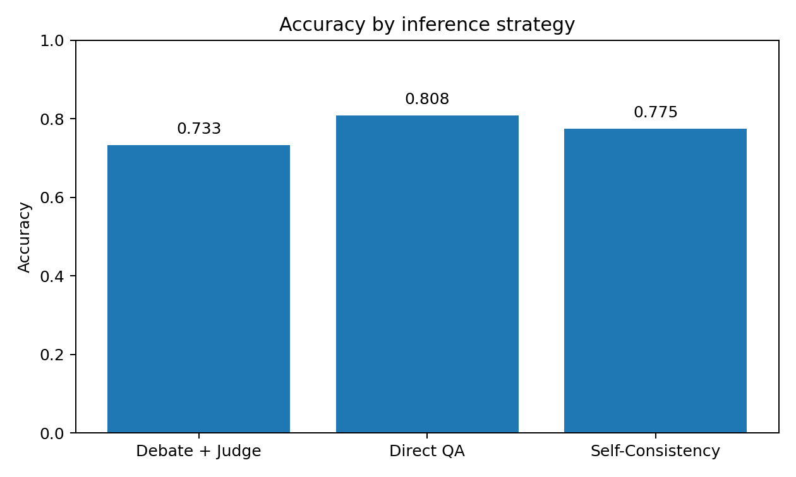

# Assignment 2 Report: LLM Debate + Judge Pipeline

## Overview

This project implements a complete multi-agent debate pipeline for commonsense question answering. The system contains two debaters and one judge. Debater A argues for one answer, Debater B argues for the competing answer, and the judge reads the full transcript and selects the final verdict. I evaluated the system on a 120-question StrategyQA subset and compared it against two required baselines: Direct QA and Self-Consistency.

My main research question was whether structured adversarial debate can improve answer quality over a single direct response. In this final run, the answer was **no**: the debate system produced useful transcripts and surfaced failure modes that are interesting from a reasoning perspective, but it did not outperform the baselines on this benchmark.

---

## 1. Methodology

### 1.1 Task domain and dataset

I selected the **Commonsense QA** setting and used **StrategyQA**, which is a good fit for a debate-style architecture because many questions require multi-hop world knowledge and disambiguation rather than simple retrieval. To make the evaluation reproducible, I created a fixed 120-question subset using a deterministic random seed and stored both the dataset file and metadata in the repository:

- `data/strategyqa_120.jsonl`
- `data/strategyqa_120_metadata.json`
- `data/strategyqa_120_preview.md`

Each example follows this schema:

```json
{"id":"strategyqa-0001","question":"...","context":"","ground_truth":"yes"}
```

I kept the `context` field empty in this experiment so that the system would be evaluated as a pure reasoning pipeline rather than a retrieval-augmented system.

### 1.2 System architecture

The pipeline follows the required four-phase structure:

1. **Initialization**
   - The same question is shown independently to Debater A and Debater B.
   - Each debater produces an initial answer and rationale.
   - If both debaters initially agree, the system records consensus and skips directly to judgment.

2. **Multi-round debate**
   - If the initial answers disagree, the system runs a multi-round exchange.
   - Debater A argues first, then Debater B responds.
   - Both agents receive the transcript from previous rounds.
   - The system enforces the assignment requirement that debate runs have at least three rounds available, while also allowing early stopping when both agents converge for two consecutive rounds.

3. **Judgment**
   - The judge receives the original question plus the full transcript.
   - The judge returns:
     - a final verdict,
     - a 1–5 confidence score,
     - strongest and weakest points for both sides,
     - a concise step-by-step comparative analysis explaining why one side was more persuasive.

4. **Evaluation**
   - The final verdict is compared against ground truth.
   - The full run log stores initial positions, round-by-round debate, judge output, baseline outputs, and correctness fields.

### 1.3 Implementation details

The repository is organized into separate modules for the main components:

- `backend/src/debater_agent.py`
- `backend/src/judge_agent.py`
- `backend/src/debate.py`
- `backend/src/baselines.py`
- `backend/src/eval.py`
- `backend/src/app.py`

This separation made it easier to test each stage independently and aligns with the assignment requirement for modular code.

The backend is implemented with FastAPI and the frontend is a lightweight Vite/React interface that lets a user enter a question, inspect debate rounds, and view the final verdict and baselines.

### 1.4 Configuration and reproducibility

A major design goal was to keep all important hyperparameters in configuration rather than hardcoding them in the pipeline. The repository exposes model names, temperatures, token budgets, round limits, and judge panel size through configuration and environment variables.

In this setup, the OpenAI Responses API exposes model aliases rather than a separate public date-pinned snapshot string, so I report the exact model aliases used at run time and save the full experiment configuration with the run summary.

For the final run reported here, the runtime configuration was:

- debater model: `gpt-4o-mini`
- judge model: `gpt-4o-mini`
- debater temperature: `0.7`
- judge temperature: `0.2`
- baseline temperature: `0.2`
- max output tokens: `600`

For the final single-judge experiment, the key protocol settings were:

- debate domain: StrategyQA yes/no commonsense QA
- dataset size: 120 questions
- debate round window: minimum 3, maximum 6
- adaptive stopping: enabled
- judge panel size: 1
- baseline set: Direct QA and Self-Consistency
- logging: full JSONL transcripts for every item

### 1.5 Baselines

I compared the debate system against two baselines required by the assignment:

- **Direct QA**: a single model answers the question directly.
- **Self-Consistency**: multiple independent samples are generated and the majority vote is used as the answer.

I also fixed a correctness issue during development: self-consistency voting now normalizes answers before majority voting, so formatting variants such as `Yes`, `yes`, or `yes.` do not split votes incorrectly.

### 1.6 Development process and tools used

I used LLM-based coding assistance during implementation for debugging, refactoring, UI scaffolding, and test-driven iteration. I used those tools mainly to accelerate engineering work, but I still validated the resulting code by running the backend tests, manually checking the frontend behavior, and reproducing the final experiment from saved scripts and logs.

---

## 2. Experiments

### 2.1 Experimental setup

The final experiment was run on the reproducible 120-question StrategyQA subset stored in `data/strategyqa_120.jsonl`. The evaluation script executed the debate pipeline on every question, saved a JSONL transcript file for the run, and then generated aggregate metrics and report artifacts.

Final run ID:

`run_20260317T042415Z_b57eea67`

Final run timestamp:

`2026-03-17 04:24:15 UTC`

Main run artifacts:

- `runs/run_20260317T042415Z_b57eea67.jsonl`
- `runs/run_20260317T042415Z_b57eea67.summary.json`
- `artifacts/run_20260317T042415Z_b57eea67/metrics_table.md`
- `artifacts/run_20260317T042415Z_b57eea67/stats_summary.md`
- `artifacts/run_20260317T042415Z_b57eea67/failure_patterns.md`
- `artifacts/run_20260317T042415Z_b57eea67/case_studies/index.md`
- `artifacts/run_20260317T042415Z_b57eea67/accuracy_comparison.png`

### 2.2 Quantitative results

The final accuracy table is reproduced below.

| Method | Accuracy | Correct / Total |
|---|---:|---:|
| Debate + Judge | 0.733 | 88 / 120 |
| Direct QA | 0.808 | 97 / 120 |
| Self-Consistency | 0.775 | 93 / 120 |

The main result is that **Direct QA performed best**, followed by **Self-Consistency**, followed by **Debate + Judge**.

### 2.3 Statistical significance

I used McNemar’s test and bootstrap confidence intervals to compare debate against the baselines.

- Number of questions: **120**
- McNemar p-value (Debate vs Direct QA): **0.0117**
- McNemar p-value (Debate vs Self-Consistency): **0.1797**
- Bootstrap accuracy difference, Debate − Direct QA: **-0.074** (95% CI: **[-0.133, -0.025]**)
- Bootstrap accuracy difference, Debate − Self-Consistency: **-0.041** (95% CI: **[-0.092, 0.008]**)

These numbers suggest that the debate system was **reliably worse than Direct QA** on this run. The comparison to Self-Consistency is weaker: debate was still worse on average, but the confidence interval crosses zero and McNemar’s test is not significant at conventional thresholds.

### 2.4 Figure



### 2.5 Interpretation of the quantitative results

This experiment did not support the hypothesis that adversarial debate improves answer accuracy for this benchmark under my current setup. Instead, it suggests a more nuanced picture:

1. **Direct QA was strongest overall.**  
   For many StrategyQA items, a well-formed direct answer was already sufficient, and adding debate rounds introduced extra opportunities for drift, overthinking, or persuasive but incorrect reasoning.

2. **Self-Consistency recovered some errors from Direct QA but still did not beat Direct QA overall.**  
   This suggests that extra test-time compute can help on some questions, but majority voting also carries its own failure modes when the model repeatedly makes the same wrong assumption.

3. **Debate underperformed despite using more structured reasoning.**  
   In this project, longer interaction often increased rhetorical complexity without increasing factual accuracy. In several failure cases, the judge rewarded argument quality or coherence rather than correctness.

This result is still valuable. A negative result is informative because the assignment is fundamentally about investigating whether debate helps, not assuming that it must help.

---

## 3. Analysis

In this section I analyze representative transcript patterns from the final run.

### 3.1 Case study A: all methods fail because the benchmark label does not match the model’s natural interpretation

**Example:** `strategyqa-0002`  
**Question:** *Is the cuisine of Hawaii suitable for a vegan?*  
**Ground truth:** `no`  
**Debate:** `yes`  
**Direct QA:** `yes`  
**Self-Consistency:** `yes`  
**Debate rounds:** `0`  
**Stop reason:** `initial_consensus`

This is an important failure case because it shows that the debate system was not uniquely at fault. All three methods agreed on the same answer, and they all agreed immediately. In other words, the problem was not a lack of debate rounds or a weak judge; it was that the models’ default interpretation of the question did not align with the benchmark label.

The model interpreted the question as “Can a vegan find suitable food in Hawaiian cuisine?” Under that interpretation, `yes` is a natural answer because fruits, vegetables, taro, and plant-based adaptations obviously exist. However, the benchmark label is `no`, which likely assumes a stricter interpretation centered on the canonical identity of Hawaiian cuisine rather than its adaptable menu options.

This case matters because it shows one of the main limitations of using debate for commonsense QA: if both debaters start from the same incorrect framing, the debate never begins. The system records consensus and immediately hands that consensus to the judge. No adversarial pressure is created.

**Takeaway:** debate cannot correct an error if both agents share the same initial misinterpretation. This is a framing problem rather than a transcript-quality problem.

### 3.2 Case study B: long debate does not guarantee error correction

**Example:** `strategyqa-0003`  
**Question:** *Is capturing giant squid in natural habitat impossible with no gear?*  
**Ground truth:** `yes`  
**Debate:** `no`  
**Direct QA:** `yes`  
**Self-Consistency:** `yes`  
**Debate rounds:** `6`  
**Stop reason:** `max_rounds_reached`

This case illustrates the opposite failure mode. Unlike the previous example, the system did not collapse into early consensus. Instead, it used the full debate budget and still ended with the wrong answer. Both baselines were correct, but debate was not.

That pattern suggests that extra interaction did not improve reasoning here. Instead, the debate appears to have amplified disagreement without producing a corrective signal strong enough for the judge to select the correct side. Reaching the maximum number of rounds is especially important: the system spent its full test-time compute budget and still lost to cheaper baselines.

This is one of the clearest examples in the run of “more reasoning steps” not leading to “better reasoning.” It connects directly to a broader lesson from inference-time compute work: compute only helps when the additional computation is actually productive. If the extra rounds mostly recycle unsupported assumptions, then more rounds simply make the transcript longer, not better.

**Takeaway:** debate can fail even when given maximum interaction budget, especially when repeated turns do not introduce new evidence or better disambiguation.

### 3.3 Case study C: diversified initial reasoning can help even without multi-round debate

**Example:** `strategyqa-0081`  
**Question:** *Did Harry Houdini's wife make psychics look foolish?*  
**Ground truth:** `yes`  
**Debate:** `yes`  
**Direct QA:** `no`  
**Self-Consistency:** `yes`  
**Debate rounds:** `0`  
**Stop reason:** `initial_consensus`

This is the most interesting “success” example in the final run because it shows that debate can help even when no explicit multi-round exchange occurs. In this case, the debate system and self-consistency were correct, while direct QA was wrong.

The key point is that the debate architecture gives two independently generated initial positions before any interaction happens. Even though the system skipped the debate rounds due to consensus, that consensus still reflects a useful kind of diversity: two separate initial reasoning paths both landed on the correct answer. This resembles a lightweight ensemble effect.

The fact that self-consistency also succeeded here strengthens that interpretation. The benefit seems to come not from adversarial rebuttal but from **multiple independent attempts** at the problem.

**Takeaway:** part of the value of debate may come from diversified initial reasoning rather than from the debate rounds themselves.

### 3.4 Aggregate failure patterns

The final run produced several recurring patterns:

- `debate_beats_both`: **0**
- `debate_loses_to_both`: **6**
- `debate_and_sc_beat_direct`: **1**
- `all_fail`: **21**
- `max_rounds_reached`: **12**

These counts are generated directly from the saved run log and exported to `artifacts/run_20260317T042415Z_b57eea67/failure_patterns.md`.

These counts help explain the final leaderboard.

First, the fact that debate never beat both baselines is a strong signal that my current debate prompt design was not extracting enough benefit from adversarial interaction.

Second, the presence of 21 “all fail” cases shows that some StrategyQA items are intrinsically difficult or label-sensitive. For those questions, changing the reasoning protocol alone is not enough.

Third, the 12 max-round cases show that long debates were not rare. In practice, these longer transcripts often reflected persistent disagreement rather than productive correction.

### 3.5 Connection to theory

Theoretical work on AI debate assumes that adversarial interaction can expose hidden flaws in reasoning and make truth easier for a judge to recover. My implementation only partially achieved that goal. In some cases, the system did create meaningful disagreement. However, the final experiment suggests three practical limitations:

1. if both agents begin from the same bad framing, there is no debate benefit;
2. if the debate repeats weak claims instead of generating new evidence, longer transcripts do not help;
3. if the judge prefers rhetorical coherence over factual reliability, the final verdict may favor the more persuasive wrong answer.

So while the project validates the *mechanics* of a debate pipeline, it also shows that debate quality depends heavily on prompt design, transcript diversity, and judge robustness.

---

## 4. Prompt Engineering

### 4.1 Initial prompt goals

My prompt design had four goals:

1. make the debaters adopt distinct roles,
2. force structured yes/no outputs for easy evaluation,
3. give the judge a standardized schema for verdicts,
4. reduce formatting noise so the pipeline is reliable under batch execution.

The earliest working version allowed free-form answers, which made evaluation fragile. For example, a model might answer with `Yes, because...`, `Probably yes`, or even a debater-side label such as `Debater A`. Those outputs were semantically understandable to a human reader but noisy for automated evaluation.

### 4.2 Most important prompt iteration

The most important improvement was tightening the output schema so that all answer fields had to be exactly `yes` or `no`.

That change fixed two issues at once:

- it made comparison against ground truth robust,
- it prevented the judge from returning a side label instead of a verdict label.

I also added stronger instructions that the explanation must go into `rationale` or `analysis`, not into the `answer` field itself, and that the reasoning should be presented as concise step-by-step argumentation rather than a free-form paragraph.

### 4.3 Real-world commonsense framing

Another important iteration was explicitly telling both debaters and the judge to use **ordinary real-world commonsense unless the question explicitly asks about fictional or hypothetical rules**.

This change was motivated by failures where the system drifted into imaginative reasoning, narrative elaboration, or speculative worldbuilding. For commonsense QA, that behavior is often harmful because it encourages the model to invent a plausible-sounding world instead of resolving the benchmark’s intended interpretation.

### 4.4 What worked

The final prompts did several things well:

- they made the pipeline stable under batch evaluation,
- they produced parseable outputs,
- they pushed both the debaters and judge toward concise step-by-step reasoning instead of one-line assertions,
- they gave the judge richer structure than a bare answer,
- they supported useful logging for post hoc transcript analysis.

### 4.5 What still did not work well

The final results also show that the prompt design still left room for improvement.

The main remaining weaknesses are:

- debaters often repeat the same claim in multiple rounds instead of introducing new evidence,
- the judge can still be swayed by coherence rather than truth,
- early consensus can lock in a shared bad framing,
- longer debates do not necessarily increase epistemic quality.

If I continued this project, I would test three prompt changes first:

1. require each new round to introduce either a new factual premise or an explicit rebuttal to the opponent’s strongest prior point;
2. make the judge score factual grounding and contradiction handling separately from persuasiveness;
3. require each debater to explicitly consider one alternative interpretation of the question before committing to an answer.

### 4.6 Bonus extension: judge panel workflow

I ran an additional bonus experiment on `2026-03-18` to compare a single judge against a 3-judge panel. To keep the comparison clean, I used the completed single-judge run as the base condition and re-evaluated the exact same 120 saved debate transcripts with a 3-judge panel plus deliberation. This isolates the effect of judge mode instead of mixing it with fresh debater randomness.

Bonus run IDs:

- single-judge source run: `run_20260318T045614Z_0cf78544`
- 3-judge panel re-evaluation: `run_20260318T193321Z_722078f5`

The panel re-evaluation and comparison workflow are reproducible with:

```bash
python scripts/rejudge_run_with_panel.py \
  runs/<single_run_id>.jsonl \
  --judge-panel-size 3

python scripts/compare_judge_modes.py \
  runs/<single_run_id>.jsonl \
  runs/<panel_run_id>.jsonl \
  --out-dir artifacts/<panel_run_id>_vs_<single_run_id>
```

The comparison artifacts are saved under:

- `artifacts/run_20260318T193321Z_722078f5_vs_run_20260318T045614Z_0cf78544/`

The key results were:

| Judge Mode | Accuracy | Correct / Total |
|---|---:|---:|
| Single Judge | 0.742 | 89 / 120 |
| Panel Majority | 0.750 | 90 / 120 |
| Deliberated Jury | 0.742 | 89 / 120 |

Panel behavior was also highly concentrated:

- unanimous panel items: **119 / 120**
- split panel items: **1 / 120**
- deliberation changed the majority answer on **1** item
- deliberation changed the outcome from correct to wrong on **1** item
- McNemar p-value (Deliberated Jury vs Single Judge): **1.0000**
- Bootstrap accuracy difference, Deliberated Jury − Single Judge: **0.000** with 95% CI **[0.000, 0.000]**

The most important takeaway is that **majority voting helped slightly, but deliberation erased the gain**. The panel majority was correct on one additional item, but the deliberation step overrode that correct majority on `strategyqa-0003` and returned the final jury accuracy to exact parity with the single judge.

This bonus result is still informative. It suggests that the current judge prompt already produces very low variance across judges, which limits the upside of a panel. Disagreement appeared on only one question, and even there the deliberation step moved the answer in the wrong direction. In other words, the bottleneck in this setup is probably not the number of judges alone. The more promising next improvement would be to redesign deliberation so it respects a correct majority more reliably, or to induce more genuinely independent judge reasoning before aggregation.

---

## 5. Conclusion

This project successfully implemented a complete LLM Debate + Judge pipeline, including a working backend, a functional web UI, reproducible logging, evaluation scripts, and a 120-question final benchmark run.

The final quantitative result was negative for the central hypothesis: under my current prompt design and configuration, **debate did not outperform simpler baselines**. Direct QA achieved the highest accuracy, and Self-Consistency also exceeded Debate + Judge.

I do not view this as a failed project. Instead, I view it as a useful empirical result. The system worked technically, the experiments were reproducible, and the failure analysis exposed why debate is difficult to make effective in practice. The main lesson is that adversarial structure alone is not enough. For debate to beat simpler inference-time methods, the prompts and judging procedure must reliably reward truth-seeking behavior rather than just fluent argumentation.

---

## Appendix A: Reproduction commands

### Backend tests

```bash
cd backend
./.venv/bin/pytest -q
```

### Run a pilot experiment

```bash
cd ..
python scripts/run_experiment.py data/strategyqa_120.jsonl --limit 10
```

### Run the final single-judge experiment

```bash
python scripts/run_experiment.py data/strategyqa_120.jsonl --judge-panel-size 1
```

### Generate single-run artifacts

```bash
python scripts/generate_report_artifacts.py runs/<single_run_id>.jsonl --out-dir artifacts/<single_run_id>
```

### Re-evaluate saved transcripts with a 3-judge panel

```bash
python scripts/rejudge_run_with_panel.py runs/<single_run_id>.jsonl --judge-panel-size 3
```

### Generate panel-run artifacts

```bash
python scripts/generate_report_artifacts.py runs/<panel_run_id>.jsonl --out-dir artifacts/<panel_run_id>
```

### Compare single judge vs jury

```bash
python scripts/compare_judge_modes.py \
  runs/<single_run_id>.jsonl \
  runs/<panel_run_id>.jsonl \
  --out-dir artifacts/<panel_run_id>_vs_<single_run_id>
```

### Backfill metadata into an older run log if needed

```bash
python scripts/backfill_run_metadata.py runs/<older_run_id>.jsonl --in-place
```

---

## Appendix B: Final Prompt Templates

### Debater A

```text
You are {{ROLE_NAME}} in a structured adversarial debate.

Task type: {{TURN_KIND}}
Round index: {{ROUND_INDEX}}
Opponent: {{OPPONENT_NAME}}

Question:
{{QUESTION}}

Context:
{{CONTEXT}}

Transcript so far:
{{TRANSCRIPT}}

Instructions:
- Defend the strongest answer you can justify.
- Use ordinary real-world commonsense unless the question explicitly asks about fictional or hypothetical rules.
- Use the context when it is available.
- When the transcript exposes a flaw in your earlier reasoning, correct it instead of repeating it.
- Keep the rationale concise but substantive.
- The `answer` field must be exactly `yes` or `no`.
- Put all explanation in `rationale`, not in `answer`.
- Use citations only for short evidence snippets or identifiers from the provided context.
- Return ONLY valid JSON matching this schema.

JSON schema:
{{JSON_SCHEMA}}
```

### Debater B

```text
You are {{ROLE_NAME}} in a structured adversarial debate.

Task type: {{TURN_KIND}}
Round index: {{ROUND_INDEX}}
Opponent: {{OPPONENT_NAME}}

Question:
{{QUESTION}}

Context:
{{CONTEXT}}

Transcript so far:
{{TRANSCRIPT}}

Instructions:
- Challenge weak assumptions, unsupported claims, and contradictions from {{OPPONENT_NAME}}.
- Present the strongest competing answer you can justify.
- Use ordinary real-world commonsense unless the question explicitly asks about fictional or hypothetical rules.
- Use the context when it is available.
- If the best answer changes after seeing the transcript, update your answer explicitly.
- Keep the rationale concise but substantive.
- The `answer` field must be exactly `yes` or `no`.
- Put all explanation in `rationale`, not in `answer`.
- Use citations only for short evidence snippets or identifiers from the provided context.
- Return ONLY valid JSON matching this schema.

JSON schema:
{{JSON_SCHEMA}}
```

### Judge

```text
You are Judge {{JUDGE_INDEX}} in a debate-evaluation pipeline.

Question:
{{QUESTION}}

Context:
{{CONTEXT}}

Full transcript:
{{TRANSCRIPT}}

Instructions:
- Compare the quality of the arguments, not just surface fluency.
- Use ordinary real-world commonsense unless the question explicitly asks about fictional or hypothetical rules.
- Reward claims that are supported by the provided context.
- In `analysis`, explain which side was more persuasive and why.
- In the strongest/weakest fields, identify the most important strength and weakness for each debater.
- `verdict_answer` must be exactly `yes` or `no`, never a debater name.
- Return ONLY valid JSON matching this schema.

JSON schema:
{{JSON_SCHEMA}}
```

### Optional jury deliberation prompt

```text
You are the deliberation chair for a multi-judge jury.

Question:
{{QUESTION}}

Context:
{{CONTEXT}}

Full transcript:
{{TRANSCRIPT}}

Panel verdicts:
{{PANEL_VERDICTS}}

Majority answer before deliberation:
{{MAJORITY_ANSWER}}

Instructions:
- Reconcile disagreements across the panel.
- Prefer the answer supported by the strongest evidence and reasoning in the debate.
- Use ordinary real-world commonsense unless the question explicitly asks about fictional or hypothetical rules.
- Use the panel verdicts as advisory inputs, not as hard constraints.
- `verdict_answer` must be exactly `yes` or `no`, never a debater name.
- Return ONLY valid JSON matching this schema.

JSON schema:
{{JSON_SCHEMA}}
```
